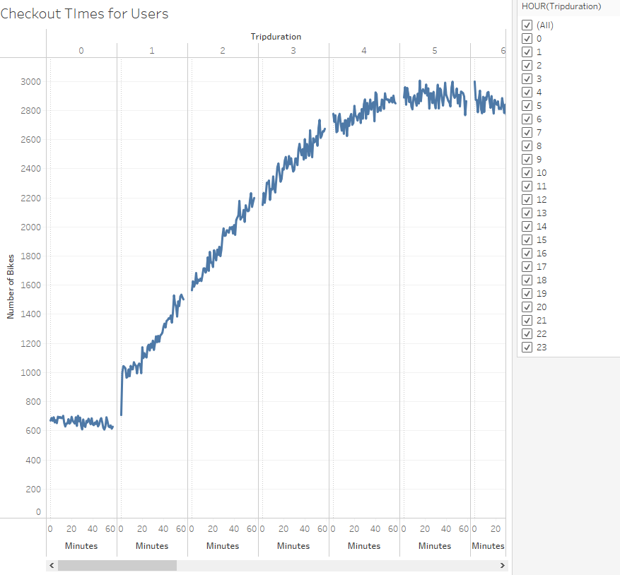
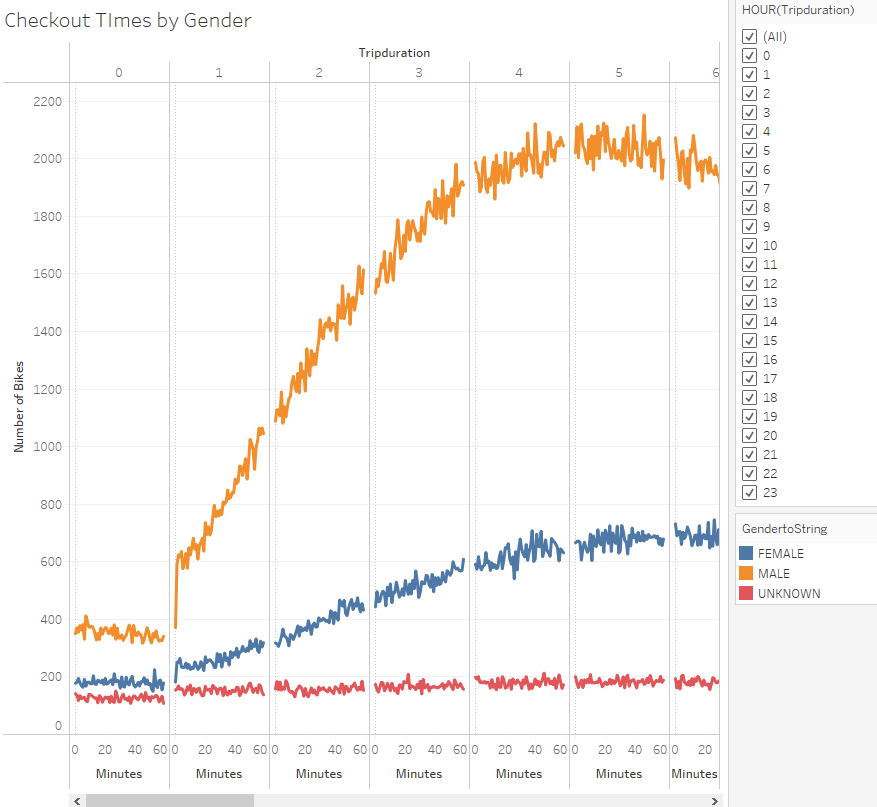
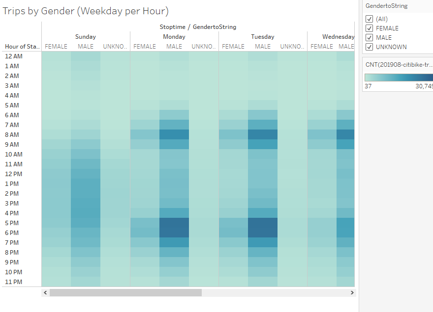
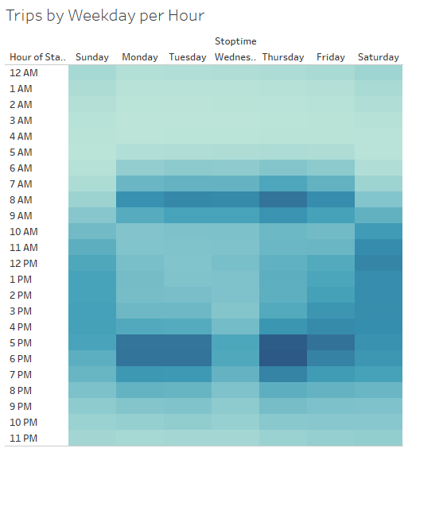
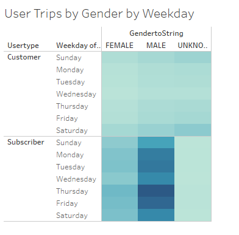
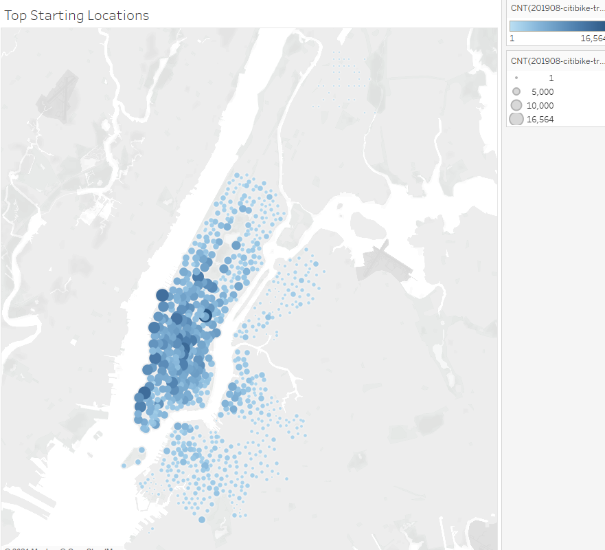
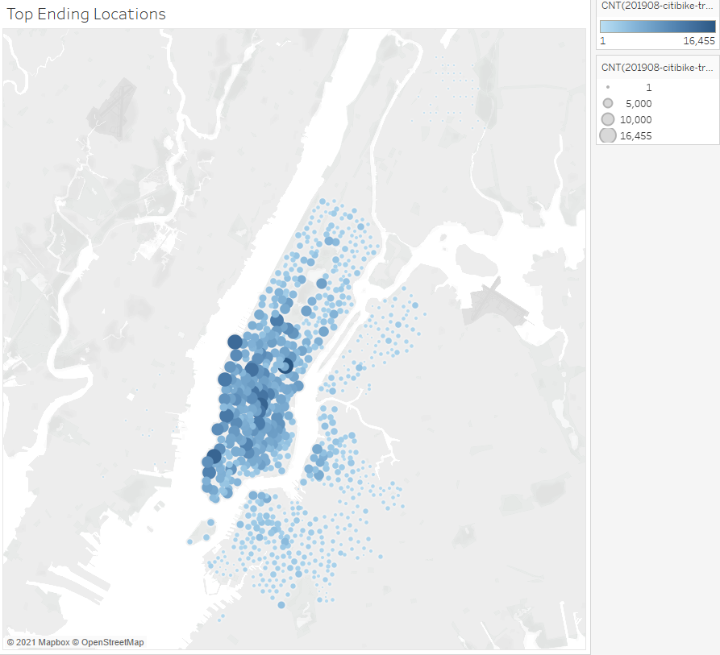

[Link to Dashboard](https://public.tableau.com/app/profile/john.fung/viz/NYC_Citibike_Challenge_16384189925110/Summary?publish=yes)
# Overview of the statistical analysis:

The purpose of the analysis is to convince investors that a bike-sharing program in Des Moines is a solid business proposal. 
Analysis includes visualizaitons to quickly understand the data. 

# Results:

Checkout times peaks around 5

There are more males checking out bikes around 5

Males have more trips throughout the week but females pick up later in the week. 

There are more trips around commute times. 

Subscriber have more trips than normal customers. 

Top starting locations are the same top ending locations.

Top ending locations are the same top starting locations. 

# Summary:
Majority of poeple use citibike to communte to work and subscriber makeup majority of the trips suggesting greater loyalty to the service.  

More analysis can be done on office locations compared to suburban areas and more understanding of average time a normal customer becomes a subscriber.   
